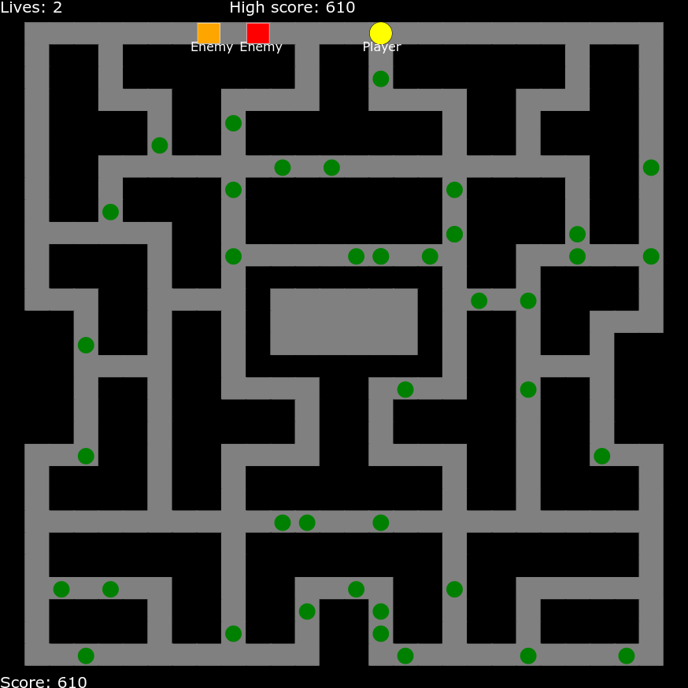

# Block Man

just pacman, but way less pretty

## Breakdown

Inside index.html:
    - the absolute basics, just setting up the canvas and adding the javascript tag

Inside index.css:
    - only one line that makes the canvas fit tightly in the screen

Inside astar.js:
    - I made a pathfinder, basically it follows the A* pathfinding algorithm to find the closest route

Inside index.js:
    - The main file, setting up the canvas with four main classes:
        1. BlockMan: the player (has a draw function to draw him and update to change position)
        2. Ghost: the enemy (same functions, follows the player around, orange follows where he is pointing to while red goes to exact position)
        3. Map: the map, has a generate map which returns a 2d array and a draw map which draws the map
            - I hand drew the map, "o" means black square, "1" means gray square that can be moved on, "2" is gray that can't
        4. Extra: the green circle bonus points, each adds 250 points to the players score
    - There is also a death function, when the lives of the player reaches 0 you are sent to the leaderboard and the
      leaderboard is shown (sorted beforehand using bubblesort)
        - Inside the death function everything is reset and new bonus points are placed on the map
    - The "animate" function is just the game loop, I set it to a certain framerate using setInterval (its at 10 frames per second I think)
    - The rest is documented
